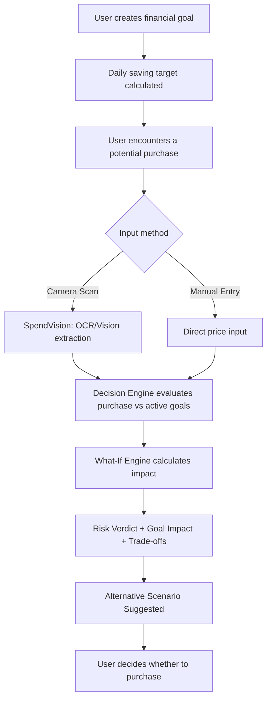
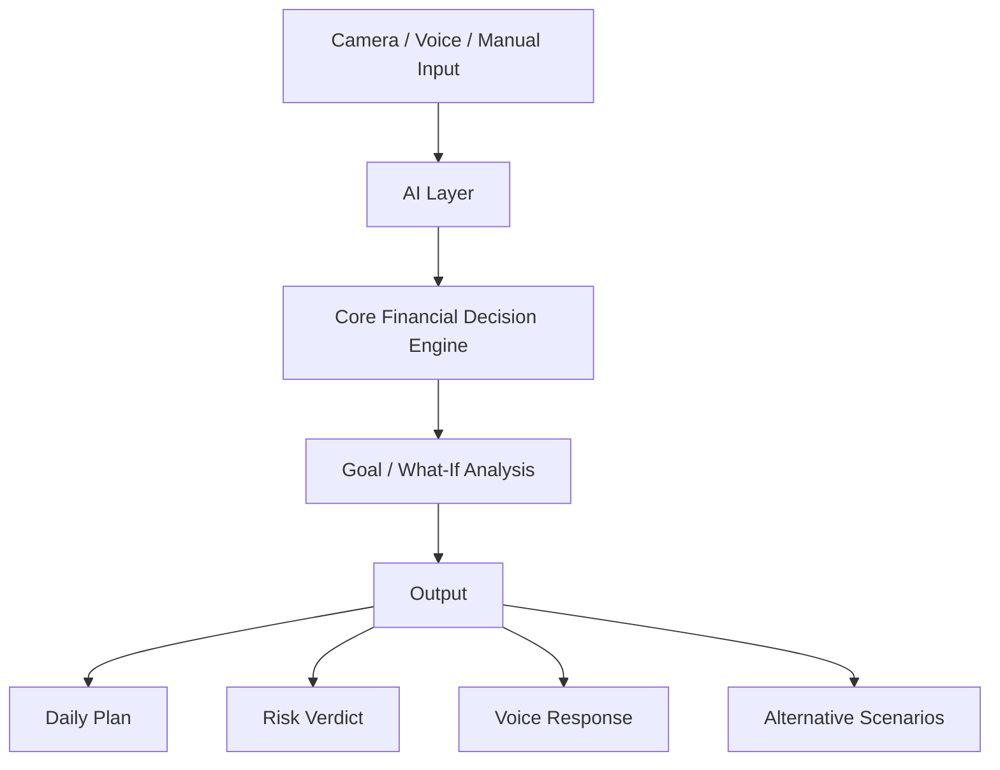

# SpendIQ — Product Requirements Document (PRD)

## "See the financial impact — before you spend."

**Team:** Namma Thaan
**Hackathon:** iQOO Hackathon 2026
**Document Type:** Product Requirements Document (PRD)

---

## 1. Product Overview

SpendIQ is an AI-powered **pre-purchase financial decision assistant**. It is designed to provide financial guidance at the moment a spending decision is being made — not after the money has already been spent.

Traditional finance applications follow a reactive model:

```
Track → Analyze → Report
```

SpendIQ follows a predictive, decision-first model:

```
Goal → Predict → Simulate → Decide → Adapt
```

The central product question SpendIQ answers is:

> **"If I spend this money now, how will it affect my financial goals?"**

---

## 2. Problem Statement

Most finance applications are reactive by design. They primarily record purchases after they happen, provide spending summaries, and show financial dashboards.

**Current problem:** Users only understand the financial consequences of a purchase after it has already occurred, at which point the decision cannot be changed.

**User pain points:**
- No guidance at the actual moment of spending
- Difficulty understanding how one purchase affects multiple financial goals simultaneously
- Financial dashboards can be hard to interpret quickly, especially for first-time earners
- No simple way to compare "what if" spending outcomes before acting

**Why existing tracking is insufficient:** Tracking and reporting explain *where money went*, but they do not help a user decide *what to do next*, in real time, before a purchase happens.

**Opportunity:** Predictive, goal-aware decision support delivered at the point of purchase — via camera, voice, or manual entry — can close this gap.

---

## 3. Product Vision

SpendIQ should act as a **financial co-pilot** that helps users make better everyday spending decisions by showing the possible consequences of a purchase before money is spent.

**Core principle:**

> "Understand the financial impact before making the purchase."

---

## 4. Target Users

### Students
- **Characteristics:** Manage pocket money, often have irregular income
- **Problems:** Difficulty planning around inconsistent inflows; limited financial experience
- **Needs:** Simple, low-jargon financial guidance
- **How SpendIQ helps:** Shows immediate, easy-to-understand impact of a purchase on savings goals via scan or voice

### Young Professionals
- **Characteristics:** Recently started earning a salary, encountering first major purchases
- **Problems:** Limited experience making large spending decisions; no decision-time support
- **Needs:** Practical, real-time guidance for bigger purchases
- **How SpendIQ helps:** Multi-goal impact analysis and what-if simulation before committing to a purchase

### First-Time Earners
- **Characteristics:** Early in developing financial discipline
- **Problems:** May not understand complex financial terminology or dashboards
- **Needs:** Clear, jargon-free explanations and actionable guidance
- **How SpendIQ helps:** Simple Safe/Caution/Risky verdicts and alternative suggestions instead of raw financial data

---

## 5. Product Goals

1. Help users understand the financial impact of a potential purchase.
2. Allow users to evaluate purchases against financial goals.
3. Provide multi-goal impact analysis.
4. Provide what-if spending simulations.
5. Give a simple Safe / Caution / Risky verdict.
6. Suggest alternatives when appropriate.
7. Allow natural voice-based financial queries.
8. Use smartphone camera capabilities through SpendVision.

*Note: These are qualitative product goals. No numerical KPIs, accuracy targets, or performance metrics are defined, as none are specified in the source material.*

---

## 6. Non-Goals

SpendIQ, in its current scope, is **NOT**:

- Not a traditional expense tracker only
- Not an investment trading platform
- Not a banking application
- Not a replacement for professional financial advice
- Not primarily a subscription management application
- Not a generic AI chatbot

> **Note:** Bank/UPI synchronization is classified as **Future Roadmap** (see Section 23), not current functionality.

---

## 7. Core User Journey

**Step 1:** User creates a financial goal. *Example: "Save ₹5,000 in 30 days."*

**Step 2:** SpendIQ calculates a dynamic daily saving target.

**Step 3:** User encounters a potential purchase. *Example: ₹1,500 product.*

**Step 4:** User scans the product using the camera, or enters the purchase manually.

**Step 5:** SpendIQ extracts/interprets the purchase information.

**Step 6:** The financial decision engine evaluates the purchase against active goals.

**Step 7:** The What-If Engine calculates the potential impact.

**Step 8:** The system provides a risk verdict, goal impact, trade-offs, and an alternative scenario.

**Step 9:** User decides whether to purchase.

### User Flow Diagram



---

## 8. Functional Requirements

### Goal Management

| ID | Requirement |
|----|-------------|
| FR-01 | User shall be able to create a financial goal. |
| FR-02 | User shall be able to specify target amount and target time period. |
| FR-03 | System shall calculate a daily saving target. |
| FR-04 | System shall dynamically update the required saving plan based on changes in the user's situation. |

### Purchase Input

| ID | Requirement |
|----|-------------|
| FR-05 | User shall be able to enter a purchase manually. |
| FR-06 | User shall be able to scan a product/receipt using the smartphone camera. |
| FR-07 | System shall use OCR/Vision capabilities to interpret product/price information. |

### Purchase Simulation

| ID | Requirement |
|----|-------------|
| FR-08 | System shall simulate the potential financial effect of a purchase before it occurs. |
| FR-09 | System shall evaluate the purchase against active financial goals. |
| FR-10 | System shall calculate goal-level impact. |
| FR-11 | System shall identify trade-offs between goals. |

### Risk Verdict

| ID | Requirement |
|----|-------------|
| FR-12 | System shall generate a SAFE / CAUTION / RISKY verdict based on the decision engine. *(Exact numerical thresholds are not defined in the source material — see Section 28, Open Questions.)* |

### Alternative Scenarios

| ID | Requirement |
|----|-------------|
| FR-13 | System shall support what-if scenarios (e.g., "What happens if I spend ₹500 more?", "What happens if I choose a lower-cost option?"). |
| FR-14 | System shall generate alternative scenarios where appropriate. |

### Voice

| ID | Requirement |
|----|-------------|
| FR-15 | User shall be able to ask financial questions through voice (e.g., "Can I afford this?", "How much should I save today?", "What happens if I spend ₹500 more?", "How can I still reach my goal?"). |
| FR-16 | Voice queries shall use the same financial decision engine as SpendVision. |

---

## 9. Multi-Goal Decision Engine

This is the core product logic of SpendIQ. Rather than performing a simple calculation such as:

```
Balance − Expense
```

SpendIQ evaluates a purchase through a structured decision flow:

```
Purchase → Cash Flow → Goal Impact → Trade-offs → Recommendation
```

A single purchase can affect multiple goals **differently**. The following is an illustrative example from the project concept:

**Example — ₹1,500 purchase:**

| Goal | Impact |
|------|--------|
| New Phone — ₹10,000 | Delays by ~4 days |
| Travel Fund — ₹8,000 | No impact |
| Emergency Fund — ₹5,000 | Pauses this week's top-up |

*This is an illustrative example from the project concept, not a guaranteed calculation output.*

---

## 10. SpendVision Requirements

**Workflow:**

```
Scan → Extract → Simulate → Verdict
```

- **Camera:** Captures the product or receipt.
- **OCR/Vision:** Extracts relevant purchase information (e.g., item name, price).
- **Decision Engine:** Evaluates the financial consequences of the extracted purchase.
- **Output:** Risk verdict + goal impact + alternatives.

---

## 11. Voice Assistant Requirements

**SpendIQ Voice workflow:**

```
Voice Input → Speech-to-Text → Intent Interpretation → Decision Engine → Financial Result → Natural Language Response
```

The LLM interprets the user's question and explains the result in natural language, but **does not** perform the financial calculations itself — the deterministic financial engine handles all core arithmetic.

---

## 12. AI Requirements

AI responsibilities are clearly separated from financial calculation responsibilities:

**AI responsibilities:**
- OCR / Vision interpretation
- Speech-to-Text
- Multimodal language understanding
- Natural-language explanation

**Financial engine responsibilities:**
- Rule-based calculations
- Goal calculations
- Goal optimization
- Predictive calculations
- What-if analysis
- Risk classification

> **Important product principle:** AI should **not** be treated as the source of truth for financial arithmetic. The deterministic decision engine performs the core financial calculations.

---

## 13. System Requirements

| Layer | Technology |
|-------|-----------|
| Frontend | Flutter |
| Backend | Node.js, REST API |
| Database | MongoDB |
| AI | OCR / Computer Vision, Speech-to-Text, Multimodal LLM |
| Core Engine | Rule-Based Engine, Goal Optimization, Predictive Model |

### Architecture Diagram



---

## 14. Non-Functional Requirements

| Category | Requirement |
|----------|-------------|
| **Performance** | The interface should provide responsive feedback during common interactions. |
| **Reliability** | Financial calculations should be deterministic and consistent for the same inputs. |
| **Explainability** | The system should explain why a purchase receives a particular verdict. |
| **Privacy** | Financial information should be handled with privacy as a core design principle. |
| **Usability** | The interface should be simple enough for students and first-time earners. |
| **Accessibility** | Voice interaction should reduce dependence on complex financial navigation. |
| **Maintainability** | AI interpretation and financial calculation should remain modular. |
| **Security** | User financial data and API communication should be protected. |

*No specific encryption algorithms, SLA values, latency targets, or compliance certifications are defined, as none are documented in the source material.*

---

## 15. User Stories

| ID | Story |
|----|-------|
| US-01 | As a student, I want to create a savings goal, so that I know how much I need to save daily. |
| US-02 | As a user, I want to scan a product, so that I can quickly evaluate its financial impact. |
| US-03 | As a user, I want to know how a purchase affects multiple goals, so that I can understand the trade-offs. |
| US-04 | As a user, I want to ask "Can I afford this?" through voice, so that I can receive financial guidance naturally. |
| US-05 | As a user, I want to compare spending scenarios, so that I can choose a financially safer option. |
| US-06 | As a young professional, I want to see a clear risk verdict before a large purchase, so that I can decide with confidence. |
| US-07 | As a first-time earner, I want simple, jargon-free explanations, so that I can understand my financial situation easily. |
| US-08 | As a user, I want to receive an alternative purchase suggestion, so that I can stay on track with my goals. |
| US-09 | As a user, I want my daily saving target to update automatically, so that my plan stays realistic. |
| US-10 | As a user, I want to enter a purchase manually when scanning isn't possible, so that I can still get a financial impact assessment. |
| US-11 | As a user, I want to understand why a purchase was marked risky, so that I can trust and act on the verdict. |

---

## 16. Acceptance Criteria

**Feature: Goal Creation**
> Given a user wants to start saving, when the user sets a target amount and time period, then the system shall calculate and display a daily saving target.

**Feature: Product Scan**
> Given the user has an active financial goal, when the user scans a product, then the system should attempt to extract the product price and use it for purchase-impact simulation.

**Feature: Multi-Goal Impact**
> Given the user has multiple active goals, when a purchase is simulated, then the system shall display the impact of that purchase on each active goal individually.

**Feature: Risk Verdict**
> Given a valid purchase and active goals, when the decision engine evaluates the purchase, then the system should return a Safe, Caution, or Risky verdict.

**Feature: What-If Simulation**
> Given an active goal and a hypothetical spending amount, when the user requests a what-if scenario, then the system shall show the projected impact of that scenario on the goal.

**Feature: Alternative Recommendation**
> Given a purchase is classified as Caution or Risky, when the system generates a response, then it shall attempt to suggest a lower-cost alternative that keeps the goal on track, where appropriate.

**Feature: Voice Query**
> Given the user asks a supported financial question via voice, when the query is processed, then the system shall route it through the same decision engine used by SpendVision and respond in natural language.

*No numerical decision thresholds are defined, as none are specified in the source material.*

---

## 17. Product Outputs

1. **Daily Financial Plan** — The dynamically calculated daily saving target based on the user's active goals.
2. **Purchase Risk Verdict** — A Safe / Caution / Risky classification for a given purchase.
3. **Goal Impact** — The specific effect of a purchase on each active goal (e.g., delay in days, no impact, pause in top-up).
4. **Voice Response** — A natural-language answer to a spoken financial question, generated from the decision engine's output.
5. **Alternative Scenarios** — Suggested lower-cost or adjusted purchase options that keep goals on track.

---

## 18. Competitive Differentiation

The comparison below reflects general capability areas based on each product's known positioning. It distinguishes between **core capabilities**, **limited/partial capabilities**, and features not confirmed as part of a product's focus. Absence of a checkmark does not imply a verified lack of capability — it reflects that the capability is not a known primary focus area.

| Capability | YNAB | Monarch Money | Copilot Money | Cleo | Rocket Money | Quicken Simplifi | Origin | **SpendIQ** |
|---|:---:|:---:|:---:|:---:|:---:|:---:|:---:|:---:|
| Budget & Expense Tracking | Core | Core | Core | Limited | Core | Core | Core | Limited |
| Financial Goal Tracking | Core | Core | Core | Limited | Limited | Core | Core | **Core (primary)** |
| AI Financial Assistance | Limited | Limited | Limited | Core | Limited | Limited | Limited | **Core (primary)** |
| Voice Interaction | — | — | — | Limited | — | — | — | **Core (primary)** |
| Camera Product Scanning | — | — | — | — | — | — | — | **Core (primary)** |
| Pre-Purchase Simulation | — | — | — | — | — | — | — | **Core (primary)** |
| Multi-Goal Impact Analysis | — | Limited | — | — | — | Limited | Limited | **Core (primary)** |
| What-If Scenarios | — | Limited | — | Limited | — | Limited | Limited | **Core (primary)** |
| Purchase Risk Verdict | — | — | — | — | — | — | — | **Core (primary)** |
| Alternative Recommendation | — | — | — | Limited | — | — | — | **Core (primary)** |
| Decision Before Spending | — | — | — | Limited | — | — | — | **Core (primary)** |

SpendIQ is positioned around its **primary workflow**:

> **"Decision-time, pre-purchase financial simulation."**

---

## 19. Unique Value Proposition

> "SpendIQ helps users understand the financial consequence of a potential purchase before they spend, by simulating its impact across multiple financial goals and recommending safer alternatives."

**Core USP:**

> **"Know the financial consequence before you buy."**

---

## 20. Product Differentiators

1. Pre-purchase financial simulation
2. Multi-goal trade-off analysis
3. SpendVision camera interaction
4. What-if spending scenarios
5. Safe / Caution / Risky verdict
6. Alternative recommendations
7. Voice-based financial interaction
8. AI interpretation with deterministic financial calculations

---

## 21. iQOO Hardware Fit

| Hardware | Role |
|----------|------|
| **Camera** | Product/receipt scanning |
| **Microphone** | Voice-based financial questions |
| **AI** | OCR/vision and natural-language interaction |
| **Phone-first** | The full scan → simulate → decide workflow happens on the smartphone |

---

## 22. MVP Scope

The Minimum Viable Product (MVP) for the hackathon prototype includes:

- Goal creation
- Daily saving target
- Manual purchase entry
- Camera-based SpendVision
- Purchase simulation
- Multi-goal impact
- Safe/Caution/Risky verdict
- What-if scenario
- Alternative recommendation
- Voice query
- Backend API
- Database

> All items above define the MVP scope. No additional features are assumed to be part of the MVP.

---

## 23. Future Roadmap

The following are explicitly **Future Enhancements**, not current functionality:

1. Deeper on-device LLM inference
2. Advanced multi-goal optimization
3. Bank / UPI synchronization
4. More personalized predictive models

---

## 24. Product Risks and Mitigations

| Risk | Impact | Mitigation |
|------|--------|-----------|
| Incorrect OCR extraction | Wrong product price used in simulation, leading to an inaccurate verdict | Allow user to review/correct extracted price before simulation runs |
| Incorrect user-entered information | Simulation output becomes unreliable | Basic input validation; allow easy correction |
| Misinterpretation of voice input | User receives an irrelevant or incorrect response | Route ambiguous queries back to the user for clarification |
| Financial calculation errors | Loss of user trust in the verdict system | Keep all core arithmetic in a deterministic, rule-based engine rather than the AI/LLM layer |
| Over-reliance on AI | Users may assume the AI is performing exact financial math | Clearly separate AI interpretation from deterministic calculation, and communicate this to users |
| Privacy concerns | Users may be hesitant to share financial data | Treat privacy as a core design principle (see Section 14) |
| Users misunderstanding a risk verdict | Poor decisions despite accurate system output | Provide explanations alongside verdicts, not just a label |

*For financial calculations specifically, the mitigation approach emphasizes deterministic validation and rule-based logic over AI-generated arithmetic.*

---

## 25. Edge Cases

| Edge Case | Expected System Behavior |
|-----------|---------------------------|
| Product price cannot be detected | Prompt the user to manually enter the price |
| User enters invalid price | Request a valid input before proceeding with simulation |
| No active financial goal | Inform the user that a goal is needed for impact simulation, and prompt goal creation |
| Multiple goals have conflicting priorities | Present the trade-offs across goals rather than silently prioritizing one (exact prioritization logic is an open question — see Section 28) |
| User changes a goal | Recalculate the daily saving target and future simulations based on the updated goal |
| User asks an unclear voice question | Ask a clarifying follow-up rather than guessing |
| Product has multiple prices | Prompt the user to confirm or select the correct price |
| User has insufficient information for simulation | Inform the user that more information is needed rather than generating an unsupported result |

---

## 26. Success Criteria

SpendIQ is successful if users can:

1. Create a financial goal.
2. Understand their daily target.
3. Evaluate a potential purchase before spending.
4. Understand the impact on multiple goals.
5. Understand the reason behind a verdict.
6. Explore what-if scenarios.
7. Receive an actionable alternative.
8. Interact through voice.

*These are qualitative success criteria. No user numbers, accuracy percentages, revenue targets, or performance statistics are defined or implied.*

---

## 27. Product Principles

**Before, not after** — Focus on decision-time guidance.

**Goals, not just balances** — Evaluate spending based on what the user is trying to achieve.

**Explain, don't confuse** — Financial results should be simple and understandable.

**AI assists, engine decides** — AI interprets and explains; deterministic logic performs financial calculations.

**Actionable guidance** — Don't simply report a problem; provide alternatives where possible.

**Privacy-first** — Financial information should be treated carefully.

---

## 28. Open Questions

The following are **open product decisions**, not finalized specifications:

- Exact risk-verdict thresholds
- Exact predictive model methodology
- How conflicting goals are prioritized
- How income variability is handled
- How missing financial information is handled
- Exact OCR failure handling
- Exact privacy/data-retention policy

---

## 29. Release Plan

| Phase | Focus |
|-------|-------|
| **Phase 1** | Core goals and daily planning |
| **Phase 2** | SpendVision and purchase simulation |
| **Phase 3** | Multi-goal trade-off engine |
| **Phase 4** | Voice interaction |
| **Phase 5** | Advanced optimization and personalization |

> Phases 1–4 (and the items listed under MVP Scope, Section 22) represent the prototype/MVP capabilities built for the hackathon. Phase 5, along with the items in Section 23 (Future Roadmap), represent future development beyond the current scope.

---

## 30. Final Product Summary

**WHAT:** SpendIQ is a pre-purchase financial decision assistant.

**WHO:** Students, young professionals, and first-time earners.

**HOW:**
```
Camera + Voice + Manual Input
→ AI Interpretation
→ Deterministic Financial Decision Engine
→ Goal Impact
→ What-If Simulation
→ Risk Verdict
→ Alternative Recommendation
```

**WHY:** Because traditional finance apps mainly explain where money went, while SpendIQ helps users understand where their next financial decision could take them.

---

> ### "SpendIQ — Your financial co-pilot, one decision at a time."
