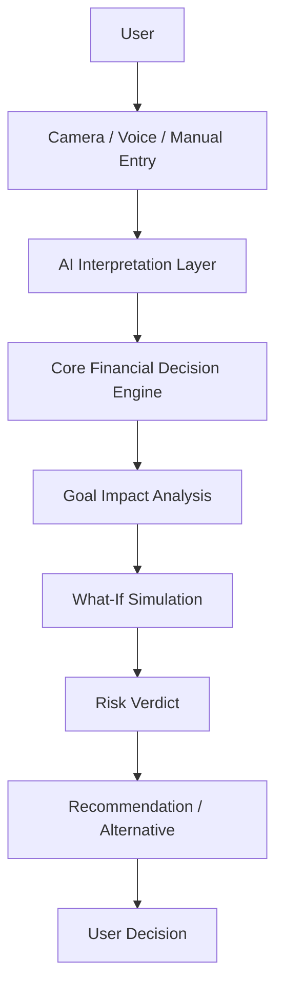

# SpendIQ

> ### 💡 "See the financial impact — before you spend."

**Team:** Namma Thaan
**Hackathon:** iQOO Hackathon 2026

---

## 1. Project Overview

SpendIQ is an AI-powered **pre-purchase financial decision assistant**. Unlike traditional finance applications that mainly track and analyze spending *after* it happens, SpendIQ helps users understand the potential financial impact of a purchase **before they spend**.

The central question SpendIQ answers is:

> **"If I spend this money now, how will it affect my financial goals?"**

---

## 2. Problem Statement

Most existing finance applications are reactive by design. They primarily record, track, categorize, and report spending after or around the time it occurs.

Users often lack decision-time guidance that explains how a potential purchase could affect their financial goals **before** they spend.

SpendIQ addresses this gap by providing predictive, goal-aware, pre-purchase financial decision support.

---

## 3. Existing Approach

Traditional financial applications follow a reactive workflow:

```
Track → Analyze → Report
```

This means the user only understands the consequences of a purchase after the money has already been spent — by which point the decision can no longer be changed.

---

## 4. Proposed Solution

SpendIQ replaces the reactive workflow with a predictive, decision-first workflow:

```
Goal → Predict → Simulate → Decide → Adapt
```

Instead of only reporting what has already happened, SpendIQ predicts what **will** happen to the user's goals if a purchase is made — and helps them decide before spending.

---

## 5. Core Concept

The SpendIQ decision engine is built to answer three core questions every time a user considers a purchase:

1. **Can I afford it?**
2. **What does it cost my goals?**
3. **What should I do instead?**

---

## 6. Key Features

### 6.1 Goal-Based Financial Planning

Users define financial goals such as:

- Save ₹5,000 in 30 days
- Save ₹10,000 for a phone
- Build an emergency fund
- Save for travel

The **Goal Engine** calculates dynamic daily saving targets based on these goals.

### 6.2 SpendVision

SpendVision allows users to point the smartphone camera at a product or receipt to instantly understand its financial impact.

**Workflow:**

```
Camera → OCR/Vision → Extract item and price → Simulate financial impact → Verdict
```

The system classifies a purchase as:

| Verdict | Meaning |
|---------|---------|
| 🟢 SAFE | Purchase has minimal impact on active goals |
| 🟡 CAUTION | Purchase noticeably affects goal progress |
| 🔴 RISKY | Purchase significantly delays or jeopardizes goals |

**Example:**

Goal: Save ₹2,000 this month
Purchase: ₹1,500

The system may show:
- Savings goal delayed by approximately 4 days
- Daily saving target increases
- Goal confidence decreases

It can also suggest an alternative:
> "Spend ₹1,000 instead → goal remains on track."

### 6.3 Multi-Goal Impact Analysis

SpendIQ does not evaluate a purchase against only one goal — it evaluates the trade-off **across all active goals**.

**Example — Purchase: ₹1,500**

| Goal | Impact |
|------|--------|
| New Phone — ₹10,000 | Delays by ~4 days |
| Travel Fund — ₹8,000 | No impact |
| Emergency Fund — ₹5,000 | Pauses this week's top-up |

**Decision flow:**

```
Purchase → Cash Flow → Goal Impact → Trade-offs → Recommendation
```

### 6.4 What-If Simulation

Users can explore different spending scenarios before committing to a purchase:

- What happens if I spend ₹500 more?
- What happens if I buy this today?
- What happens if I spend less?
- How can I still reach my goal?

The system compares the possible financial consequences and generates alternatives.

### 6.5 SpendIQ Voice

Users can interact naturally through voice, asking questions such as:

- "Can I afford this?"
- "How much should I save today?"
- "What happens if I spend ₹500 more?"
- "How can I still reach my goal?"

Voice interaction uses the **same financial decision engine** as SpendVision, ensuring consistent answers regardless of input method.

### 6.6 Risk Verdict

Every simulated purchase results in a clear, understandable verdict (SAFE / CAUTION / RISKY) so users can make quick, confident decisions without needing to interpret complex financial data themselves.

### 6.7 Alternative Recommendations

Instead of simply saying a purchase is risky, SpendIQ provides a safer alternative scenario.

**Example:**
- ₹1,500 purchase → Goal delayed
- ₹1,000 alternative → Goal remains on track

---

## 7. How SpendIQ Works

SpendIQ intentionally separates **AI interpretation** from **financial calculation**, so that the numbers users rely on come from a deterministic, predictable engine — not an AI language model.

**AI Layer** (interprets input and explains output):
- OCR / Vision
- Speech-to-Text
- Multimodal LLM

**Core Engine** (performs the actual financial calculations):
- Rule-Based Engine
- Goal Optimization
- Predictive Model

This produces a clear separation of responsibility:

```
AI interpretation → Deterministic financial calculation → AI explanation
```

The LLM interprets and explains the user's request but does **not** perform the core financial mathematics.

---

## 8. User Journey

**Step 1: Set a goal**
> "Save ₹5,000 in 30 days."

**Step 2: Get a daily target**
The Goal Engine calculates a dynamic daily saving plan.

**Step 3: Scan a product**
The user scans a ₹1,500 item.

**Step 4: Simulate impact**
The What-If Engine evaluates the purchase.

**Step 5: Get a verdict**
> "Delays your goal by approximately 3 days."

**Step 6: Adapt and decide**
The system generates an alternative plan.

---

## 9. System Architecture



**AI Interpretation Layer** consists of OCR/Vision, Speech-to-Text, and a Multimodal LLM.

**Core Financial Decision Engine** consists of a Rule-Based Engine, Goal Optimization, and a Predictive Model.

```mermaid
flowchart LR
    subgraph Input
        C1[Camera]
        C2[Voice]
        C3[Manual Entry]
    end

    subgraph AI["AI / Intelligence Layer"]
        A1[OCR / Computer Vision]
        A2[Speech-to-Text]
        A3[Multimodal LLM]
    end

    subgraph Core["Core Financial Engine"]
        E1[Rule-Based Engine]
        E2[Goal Optimization]
        E3[Predictive Model]
    end

    subgraph Output
        O1[Daily Plan]
        O2[Risk Verdict]
        O3[Voice Response]
        O4[Alternative Scenarios]
    end

    Input --> AI --> Core --> Output
```



---

## 10. Technology Stack

| Layer | Technology |
|-------|-----------|
| Frontend | Flutter |
| AI / Intelligence | OCR / Computer Vision, Speech-to-Text, Multimodal LLM, Predictive Model |
| Backend | Node.js, REST API |
| Database | MongoDB |
| Core Financial Logic | Rule-Based Engine, Goal Optimization, Predictive Model |

**Input Methods:** Camera, Voice, Manual Entry

**Output Types:** Daily Plan, Risk Verdict, Voice Response, Alternative Scenarios

---

## 11. AI and Financial Decision Engine

SpendIQ's architecture is deliberately designed so that AI handles *interpretation* while a deterministic engine handles *calculation*:

- **OCR / Vision** — reads product names and prices from the camera feed
- **Speech-to-Text** — converts voice queries into structured requests
- **Multimodal LLM** — interprets user intent and explains results in natural language
- **Rule-Based Engine, Goal Optimization, Predictive Model** — perform the actual financial math that determines affordability, goal impact, and verdicts

This separation ensures that financial outcomes shown to the user are consistent and predictable, while the AI layer is responsible for making the experience natural and conversational.

---

## 12. Example Use Case

A user wants to save ₹10,000 for a phone in 45 days.

The user sees a product costing ₹1,500 and scans it using SpendVision.

The system:
1. Extracts the product price
2. Checks active financial goals
3. Simulates the ₹1,500 purchase
4. Calculates the impact on each goal
5. Generates a risk verdict
6. Suggests a lower-cost alternative if appropriate

**Result:**
> "Your phone goal may be delayed by approximately 4 days."

**Alternative:**
> "Spend ₹1,000 instead → goal remains on track."

---

## 13. Target Users

### 🎓 Students
- Managing pocket money
- Irregular income
- Learning financial discipline

### 💼 Young Professionals
- First salary
- First major purchases
- Need for practical financial guidance

### 🌱 First-Time Earners
- Building financial discipline
- Need simple explanations
- Prefer guidance without financial jargon

---

## 14. Competitor Analysis

SpendIQ operates in a space adjacent to existing budgeting and financial-goal apps, but focuses specifically on the **pre-purchase decision moment** rather than after-the-fact tracking. The comparison below reflects general capability areas based on each product's publicly known positioning; it distinguishes between **core capabilities**, **limited/partial capabilities**, and features that are **SpendIQ's primary focus**.

| Capability | YNAB | Monarch Money | Copilot Money | Cleo | Rocket Money | Quicken Simplifi | Origin | **SpendIQ** |
|---|:---:|:---:|:---:|:---:|:---:|:---:|:---:|:---:|
| Budget & Expense Tracking | Core | Core | Core | Limited | Core | Core | Core | Limited |
| Financial Goal Tracking | Core | Core | Core | Limited | Limited | Core | Core | **Core (primary)** |
| AI Financial Assistance | Limited | Limited | Limited | Core | Limited | Limited | Limited | **Core (primary)** |
| Voice-Based Interaction | — | — | — | Limited | — | — | — | **Core (primary)** |
| Camera Product Scanning | — | — | — | — | — | — | — | **Core (primary)** |
| Pre-Purchase Simulation | — | — | — | — | — | — | — | **Core (primary)** |
| Multi-Goal Impact Analysis | — | Limited | — | — | — | Limited | Limited | **Core (primary)** |
| What-If Spending Scenarios | — | Limited | — | Limited | — | Limited | Limited | **Core (primary)** |
| Purchase Risk Verdict | — | — | — | — | — | — | — | **Core (primary)** |
| Alternative Purchase Recommendation | — | — | — | Limited | — | — | — | **Core (primary)** |
| Decision Before Spending | — | — | — | Limited | — | — | — | **Core (primary)** |

*Note: "—" indicates the capability is not a known focus area of the product, not that it is confirmed absent. This table reflects general product positioning rather than exhaustive feature audits.*

---

## 15. Competitive Differentiation

Most competitors in this space are strong at **recording and organizing** financial data — budgets, transactions, and goal balances. Where SpendIQ differs is in **when** it engages the user: at the moment of decision, before money leaves their account, rather than afterward during a review or report.

SpendIQ's differentiation is not about doing more of what these tools already do — it is about addressing a **decision-time gap** that after-the-fact tracking tools are not designed to fill.

---

## 16. Unique Selling Proposition

### 🎯 Core USP

> **"Know the financial consequence before you buy."**

**Key differentiators:**

1. Pre-purchase financial simulation
2. Multi-goal trade-off analysis
3. Camera-based SpendVision
4. What-If purchase simulation
5. Safe / Caution / Risky verdict
6. Alternative purchase recommendations
7. Voice interaction
8. AI interpretation + deterministic financial calculation

---

## 17. Innovation

Traditional financial apps follow a linear, after-the-fact model:

```
Money → Transaction → Tracking → Reports
```

SpendIQ reframes this into a forward-looking, decision-support model:

```
Goal → Potential Purchase → Simulation → Goal Impact → Trade-Off → Recommendation → Decision
```

The key innovation is **not** simply "using AI." It is the combination of:

- Goal awareness
- Purchase context
- Predictive simulation
- Multi-goal optimization
- Deterministic financial logic
- Natural-language / voice interaction
- Camera-based purchase understanding

None of these alone is novel — the innovation lies in bringing them together at the exact moment a purchase decision is being made.

---

## 18. iQOO Hardware Integration

| Hardware | Role in SpendIQ |
|----------|-----------------|
| **Camera** | Used to scan products and receipts for SpendVision |
| **Microphone** | Used for natural voice-based financial questions |
| **On-device AI** | Used for OCR/vision interpretation and natural-language interaction |
| **Phone-first design** | The complete scan → simulate → decide journey occurs entirely on the smartphone |

SpendIQ is designed around the smartphone as the primary decision-making device — the phone that lets a user check the price is the same phone that tells them what that price means for their goals.

---

## 19. Development Scope

The prototype was built in **30 hours** during iQOO Hackathon 2026.

**Implemented / scoped components:**

- Goal engine with live daily-target calculation
- SpendVision scan → extraction → verdict
- What-If purchase simulation
- Multi-goal impact calculation
- Voice query using the same decision engine

> All capabilities listed above reflect the prototype scope built for this hackathon; features not listed here should be considered part of the future roadmap, not current functionality.

---

## 20. Social Impact and SDG Alignment

*The following SDG alignment reflects project **positioning** and intended real-world impact, not a claim of explicit technical implementation.*

### 🎯 SDG 8: Decent Work and Economic Growth
By helping students, young professionals, and first-time earners build financial discipline early, SpendIQ supports healthier personal financial habits that can contribute to long-term economic stability and growth.

### 🎯 SDG 12: Responsible Consumption and Production
By surfacing the consequences of a purchase *before* it is made, SpendIQ encourages users to think critically about their spending choices — supporting more mindful, responsible consumption rather than impulsive purchasing.

Better financial decision-making, made accessible at the moment of purchase, can help users build lasting financial discipline while consuming more intentionally.

---

## 21. Future Roadmap

The following items represent planned future enhancements beyond the current hackathon prototype:

- Deeper on-device LLM inference
- Advanced multi-goal optimization
- Bank / UPI synchronization
- More personalized predictive models

---

## 22. Team

### Team Namma Thaan

| Member | Role |
|--------|------|
| **Nithyasri** | Product Strategy, Data/AI Logic, UX |
| **Varshika** | Flutter Frontend, Camera/Voice Integration, Demo |
| **Haripriya** | Backend, Database, API Integration |

---

## 23. Conclusion

**SpendIQ** is a goal-aware, pre-purchase financial decision engine that predicts how a potential purchase affects multiple financial goals and recommends safer alternatives before the user spends.

**What it does:** SpendIQ simulates the financial impact of a purchase before it happens, evaluating it against all of a user's active financial goals and returning a clear SAFE / CAUTION / RISKY verdict, along with alternative suggestions.

**Who it helps:** Students, young professionals, and first-time earners who need practical, jargon-free guidance to build financial discipline.

**How it works:** Through Camera (SpendVision), Voice, or Manual Entry, an AI interpretation layer extracts and understands the purchase context, which is then passed to a deterministic financial engine that calculates goal impact, simulates what-if scenarios, and generates a recommendation.

**What makes it different:** Unlike traditional finance apps that track and report spending after the fact, SpendIQ engages the user at the moment of decision — before money is spent — using multi-goal impact analysis, camera-based scanning, and voice interaction, all powered by a clear separation between AI interpretation and deterministic financial calculation.

**Why the pre-purchase approach matters:** Financial decisions are made in the moment, not during a monthly review. By delivering goal-aware insight at the exact point of purchase, SpendIQ helps users act on financial guidance when it can actually make a difference — turning reactive tracking into proactive decision-making.

---

> ### "See the financial impact — before you spend."
